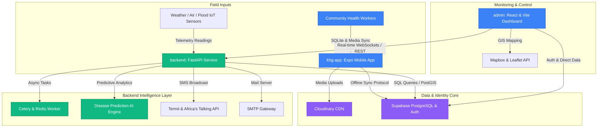

# KHG Africa (Koolvix Health & Geo-Intelligence Africa)

KHG Africa is an AI-powered, offline-first climate-health early warning infrastructure designed to protect vulnerable African children from climate-related disease outbreaks and environmental health risks.
By combining smart environmental sensing, community reporting, predictive AI, and low-connectivity communication systems, KHG Africa enables schools, clinics, governments, and NGOs to detect, predict, and respond to threats such as malaria, cholera, heat stress, flooding, and air pollution before they escalate into child health emergencies.
Built specifically for low-resource African communities, KHG Africa transforms schools and rural clinics into intelligent climate-health protection hubs capable of safeguarding children at scale.
By integrating **IoT Environmental Sensors**, **Crowdsourced Community Health Reports**, **PostGIS Geo-Intelligence**, and **Predictive Machine Learning Models**, the platform provides real-time risk assessment, disease prediction, and automated emergency dispatches.

---

## 🏗️ System Architecture

The KHG Africa ecosystem is composed of three primary decoupled layers, orchestrating a seamless flow from field capture to administrative oversight.



---

## 📁 Repository Structure

The workspace is organized into three main component folders:

### 1. [💻 `admin`](/admin) (Admin Web Portal)
A Vite-powered React and TypeScript web dashboard tailored for NGOs, health ministries, and emergency response planners.
* **Tech Stack**: React 19, TypeScript, Vite, Chakra UI, Recharts, React Leaflet, React Router Dom, Zustand.
* **Key Capabilities**:
  * Real-time geospatial risk mapping via Leaflet and Mapbox.
  * Live sensor reading graphs and disease trend analytics using Recharts.
  * Automated emergency deployment dispatching interfaces.
  * System settings administration and audit logs viewer.

### 2. [⚙️ `backend`](/backend) (FastAPI Intelligence Engine)
A high-performance Python FastAPI service responsible for geospatial operations, asynchronous jobs, AI predictions, and external system integrations.
* **Tech Stack**: FastAPI, Uvicorn, SQLAlchemy, Alembic, PostgreSQL + PostGIS, Redis, Celery, Supabase SDK, pandas, numpy, scikit-learn.
* **Key Capabilities**:
  * **AI Engine**: Disease prediction models running predictive analytics on sensor telemetry.
  * **Simulation**: An active simulation loop generated dynamically on startup to simulate fluctuating environmental telemetry.
  * **Realtime Server**: WebSocket endpoints (`/ws/realtime`) supporting immediate UI and notification updates.
  * **Alert Gateway**: Integrated with SMTP mail servers and multi-channel SMS (Termii & Africa's Talking).

### 3. [📱 `khg-app`](/khg-app) (Mobile Field Companion)
An Expo React Native mobile application built for community health workers and local residents operating in environments with intermittent connectivity.
* **Tech Stack**: React Native, Expo 54, Expo SQLite, Zustand, Redux Toolkit, React Query, TailwindCSS (via NativeWind), Expo Camera, Expo AV (Voice Recording).
* **Key Capabilities**:
  * **Offline-First Synchronization**: Locally stores reports in SQLite and queues them in `offline_sync_queue` for seamless cloud sync upon network recovery.
  * **Rich Media Reports**: Allows field agents to record voice notes and snap photos of stagnant water, waste buildup, or illness outbreaks.
  * **Geo-Location Capture**: Automatically tracks precise GPS coordinates for high-fidelity geospatial intelligence.

---

## 🗄️ Database Schema & PostGIS Geo-Intelligence

The Supabase PostgreSQL database leverages the **PostGIS** extension to calculate localized risk bounds.

```
┌─────────────────────────┐
│        profiles         │ ◄─── RBAC Roles (super_admin, clinic_staff, health_worker)
└────────────┬────────────┘
             │
             ▼
┌─────────────────────────┐        ┌─────────────────────────┐
│    community_reports    │ ──────►│   offline_sync_queue    │ ◄─── SQLite-to-Cloud queue
├─────────────────────────┤        └─────────────────────────┘
│  id (UUID)              │
│  reporter_id (FK)       │        ┌─────────────────────────┐
│  type (Enum)            │ ──────►│   sensor_devices        │ ◄─── Weather, Air Quality, Flood
│  location (GEOGRAPHY)   │        └────────────┬────────────┘
│  image_url & voice_note │                     │
└─────────────────────────┘                     ▼
                                   ┌─────────────────────────┐
                                   │   sensor_readings       │ ◄─── Telemetry (temp, rain, UV)
                                   └─────────────────────────┘
```

### Key DB Tables:
1. `profiles`: Tracks system users and Role-Based Access Control (RBAC).
2. `schools` & `clinics` & `communities`: Stores regional hubs with PostGIS coordinates.
3. `sensor_devices` & `sensor_readings`: Connects live IoT sensors and stores their historical environmental metrics.
4. `disease_predictions`: Contains ML output detailing outbreak probability scores by region.
5. `community_reports`: Contains fields for image uploads, voice notes, severity scales, and coordinate mappings.
6. `risk_alerts` & `emergency_interventions`: Powers real-time emergency team tracking and dispatches.
7. `offline_sync_queue`: Caches database actions locally for asynchronous delivery.

---

## 🚀 Installation & Local Environment Setup

### 📋 Prerequisites
* **Node.js** (v18+ recommended) & npm
* **Python** (v3.10+ recommended) & virtualenv
* **Docker** (Optional, for running Redis and PostgreSQL/PostGIS locally)
* A active **Supabase** project instance.

---

### 1. Set Up the Backend Service (`/backend`)

1. **Navigate to the backend directory**:
   ```bash
   cd backend
   ```

2. **Create and activate a virtual environment**:
   ```bash
   # On Windows
   python -m venv venv
   .\venv\Scripts\activate

   # On MacOS/Linux
   python3 -m venv venv
   source venv/bin/activate
   ```

3. **Install Dependencies**:
   ```bash
   pip install -r requirements.txt
   ```

4. **Configure Environment Variables**:
   Create a `.env` file in the `/backend` folder based on `.env.example`:
   ```bash
   cp .env.example .env
   ```
   *Update the variables with your active Supabase, Redis, Cloudinary, Termii, and SMTP credentials.*

5. **Initialize Database Tables**:
   If starting with a clean Supabase database, run the schema creation:
   ```bash
   # You can run the schema commands from `supabase_schema.sql` directly inside Supabase SQL Editor.
   # Next, run seed data (optional):
   python seed_data.py
   ```

6. **Start the FastAPI Server**:
   ```bash
   python -m app.main
   ```
   *The server will start on `http://localhost:8000`. It will also launch the automated sensor simulation loop in the background!*

---

### 2. Set Up the Admin Web Dashboard (`/admin`)

1. **Navigate to the admin directory**:
   ```bash
   cd admin
   ```

2. **Install node packages**:
   ```bash
   npm install
   ```

3. **Configure Environment Variables**:
   Ensure a `.env` file exists with the following configuration:
   ```env
   VITE_SUPABASE_URL=https://your-project.supabase.co
   VITE_SUPABASE_ANON_KEY=your-anon-key
   VITE_FASTAPI_URL=http://localhost:8000
   VITE_WS_URL=ws://localhost:8000/ws
   VITE_MAPBOX_TOKEN=your-mapbox-token
   ```

4. **Launch Development Server**:
   ```bash
   npm run dev
   ```
   *Open `http://localhost:5173` to explore the admin panel.*

---

### 3. Set Up the Mobile Application (`/khg-app`)

1. **Navigate to the mobile app directory**:
   ```bash
   cd khg-app
   ```

2. **Install Node Packages**:
   ```bash
   npm install
   ```

3. **Configure Environment Variables**:
   Create a `.env` file based on `.env.example`:
   ```env
   EXPO_PUBLIC_SUPABASE_URL=https://your-project.supabase.co
   EXPO_PUBLIC_SUPABASE_ANON_KEY=your-anon-key
   EXPO_PUBLIC_FASTAPI_BASE_URL=http://your-computer-ip:8000
   EXPO_PUBLIC_FASTAPI_WS_URL=ws://your-computer-ip:8000/ws
   EXPO_PUBLIC_APP_ENV=development
   EXPO_PUBLIC_DEMO_MODE=true
   ```
   > ⚠️ **Important**: When running on local hardware (physical Android/iOS devices), replace `localhost` with your local network IP (e.g., `192.168.1.100`) so the phone can reach the backend.

4. **Launch Expo CLI**:
   ```bash
   npm run start
   ```
   *Scan the QR code with the Expo Go app on your mobile device to run the app.*

---

## 🛡️ Gitignore Standards

This project utilizes a workspace-wide **Master `.gitignore`** at the root level which seamlessly filters:
- OS-specific junk (`.DS_Store`, `Thumbs.db`)
- IDE / Editor environments (`.vscode/`, `.idea/`)
- Sensitive credential files (`*.env`, `.env.local`)
- Build distributions, caches, and massive modules per sub-application (`node_modules/`, `venv/`, `dist/`, `.expo/`).

*Make sure not to commit your localized `.env` files to maintain platform security.*
